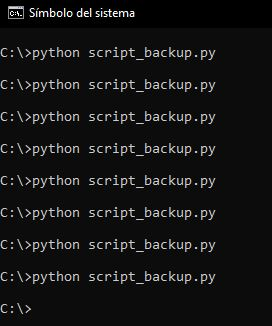
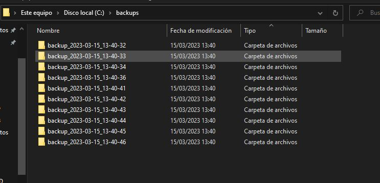
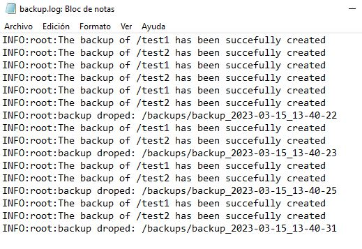

*Name: Xabier Vega Castellà*

### *Requirements:*

• The script should be able to create a backup of all files and directories specified in a configuration file.

• The configuration file should allow specifying multiple directories to be backed up, and where the backups should be stored.

• The script should create a new backup directory for each backup run with the current timestamp in the directory name.

• The script should keep a configurable number of backups and delete the oldest backups when the maximum number is reached.

• The script should log the backup process, including any errors encountered during the backup.

• The script should be runnable as a scheduled task.

---
### *step by step*.

The first thing to create is a configuration file named `conf.ini`

```python

[backup]
# set up the paths to be backed up
set_source= /test1, /test2
# set de destination of backups.
set_destination= /Backups/

[cuantity]
# set the maximum cuantity of backup that be store
max = 10
```
Then create the script with python. The first thing to do is to know which libraries to use. I use these libraries:

```python
import shutil # To do the new directory and create all
import configparser # To read the cofiguration file
import os #solves compatibility problems between operative systems.
import datetime # To set the time in the backup
import logging # To do the register loggin in logsfile
```

To read the configuration file I use the following two lines, where `parser` is equal to call the function and `parser.read` reads the file.

```python
parser=configparser.ConfigParser()
parser.read("conf.conf")
```

Now we have to tell it what it is going to read from the file.
For that we are going to define a fuction called `backup_dirs` with the section where it find the paths inside the configuration file and separate it by commas to choose different directories using `split`, also define another function called `backup_location`, this fuction read the section where it will leave the copy of the file.
```python
backup_dirs = parser.get('backup', 'set_source').split(',')
backup_location = parser.get('backup', 'set_destination')
```
Also define one fuction called `max_b` this read the section inside the configuration file that say the maximum of backups that can be created, its 10 backup directory.

```python
max_b = parser.getint('cuantity', 'max')
```
The next step is create the directory with the current date and containing the copies of the directories you want.
For this we have to define a function called `time` that will contain the format of the date.
```python
time = datetime.datetime.now().strftime('%Y-%m-%d_%H-%M-%S')
```
Create a function called `backup_p` that joins the location indicated in the configuration file with the name `backup_` and add the current date.
Then add `os.mkdir(backup_p)` to create the folder.

```python
backup_p = os.path.join(backup_location, f'backup_{time}')
os.mkdir(backup_p)
```
For a logs create an order that registers all the deletions and creations indicating the path of the log file.
```python
logging.basicConfig(filename='backup.log', level=logging.INFO)
```
The next thing to do is to create a condition for the creation of the copies.
Call the condition `directory` and tell it that if the directory exists it will create a copy with the name previously specified in `backup_p`, also register the creation into the log file, and if the copy fails, log it with an error and if the directory is not found, also log it.
```python
            logging.info(f"The backup of {directory} has been succefully created")
        except Exception as e:
           logging.error(f"{directory} has an error with the backup: {e}")
    else:
        logging.error(f'{directory} does not exist')
```

Finally the oldest backups should be deleted when a new one is registered, for this, we are going to order them from the oldest copy to the most recent one in ascending order, this function is called `backup_d`.
```python
backup_d = sorted([os.path.join(backup_location, d)
                   for d in os.listdir(backup_location) 
                   if os.path.isdir(os.path.join(backup_location, d))])
```
After that create a condition that says that if `backup_d` is greater than `max_b` a function called `oldest` is defined and it assigns the oldest backup and then deletes it with `rmtree` and the whole process is recorded in the log file.

To make the script run automatically in windows put the nex command in console `schtasks /create /tn "Daily Backup" /tr "python C:\task1\backup_script.py" /sc daily /st 02:00:00`. The above command makes a scheduled task on the system to run the command `python C:\backup_script.py` every day at 2am

In linux execute the command `crontab -e` and add a new line with `0 2 * * * python3 backup_script.py` where it is indicated that it will be executed every day at 2am

---

### Checks

In the next steps can we see how run the program in terminal and create the backups in the specificate path





Also we see the logs file and how save all creations and deletions.

