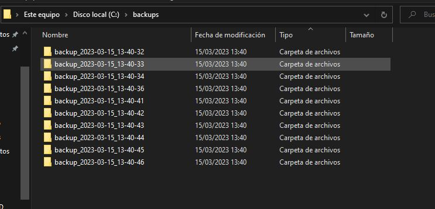
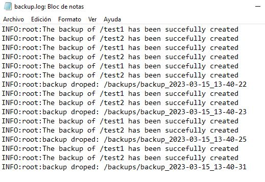

<center>

# 


</center>

*Name: Xabier vega castellà*

### *Requirements:*

• The script should be able to create a backup of all files and directories specified in a configuration file.

• The configuration file should allow specifying multiple directories to be backed up, and where the backups should be stored.

• The script should create a new backup directory for each backup run with the current timestamp in the directory name.

• The script should keep a configurable number of backups and delete the oldest backups when the maximum number is reached.

• The script should log the backup process, including any errors encountered during the backup.

• The script should be runnable as a scheduled task.

### *Desarrollo*.

The first thing to create is a configuration file named `conf.ini`

```python

[backup]
# set up the paths to be backed up
set_source= /test1, /test2
# set de destination of backups.
set_destination= /Backups/

[cuantity]
# set the maximum cuantity of backup that be store
max = 10
```
Then create the script with python. The first thing to do is to know which libraries to use. I use these libraries:

```python

import datetime # To set the time in the backup
import os #solves compatibility problems between operative systems.
import shutil # To do the new directory and create all 
import configparser # To read the cofiguration file
import logging # To do the register loggin in logsfile

```

Creamos la conexion con el servidor.
+ Para ello vamos a la maquina cliente y aseguramos que el nombre de equipo y de dominio este bien puesto. 



+ Ahora vamos a Yast -> LDAP y Kerberos. En el caso de que no nos aparezca esta herramienta, la podemos instalar con el paquete `yast2-auth-client`. Configuramos y comprobamos la conexión.



+ Ahora comprobamos desde la terminal:
```
id mazinger                          consultar información del usuario.

getent passwd mazinger               consultamos más datos del usuario.

cat /etc/passwd | grep mazinger      nos aseguramos que el usuario NO es local.

su -l mazinger                       entrar con el usuario definido en LDAP.
```


+ En el servidor creamos el robot1.


+ Ponemos la clave del usuario.


+ Consultamos la lista de usuarios y vemos que esta robot1:


+ Vamos a la maquina cliente y entramos en el usuario.


+ Ahora en el cliente vamos a editar el fichero `ldap.conf` en la ruta `/etc/openldap/`. Esto lo hacemos para acceder de forma anonima, ya que con entorno grafico, entrando con usuario y contraseña, nos da errores y no he sabido resolverlos, la unica manera que he visto es esta.


+ Entramos en la herramienta Usuarios y grupos y accedemos como anonimo.


+  vamos a crear el grupo villanos y los usuarios varon y robot y los meteremos dentro de los grupos que se nos indica.

    + He de decir que los usuarios no los he podidio crear porque de forma anonima no se puede escribir ya que no tenemos permisos de ejecución, sin embargo he puesto un ejemplo sobre como estarian creados y añadidos los usuarios al servidor LDAP


+ Ahora desde el cliente consultamos en la base de datos LDAP la informacion de un usuario existente, en mi caso mazinger.


+ Y por ultimo cerramos sesion en el usuario nuestro y entramos desde el cliente a mazinger.


