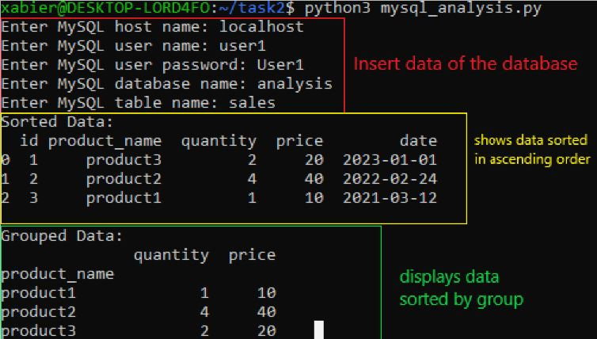
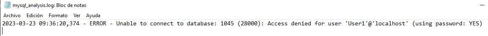
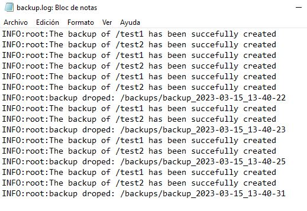

***Xabier Vega Castella***
### *Requirements:*

• The script should connect to a MySQL database using the mysql-connector-python library.
• The script should retrieve data from a specified table in the database.
• The script should perform some data analysis on the retrieved data using the pandas library.
• The data analysis should include at least one of the following: sorting, filtering, grouping, 
  aggregation, or visualization.
• The script should log any errors encountered during the data retrieval or analysis.
• The script should be runnable as a command-line application

---
### *step by step*.

The first thing to create is a databases and some table.

```python

CREATE DATABASE IF NOT EXISTS `analysis` DEFAULT CHARACTER SET latin1;

USE `analisys`;

CREATE TABLE sales (
  id varchar(10) NOT NULL,
  product_name varchar(30) DEFAULT NULL,
  quantity integer DEFAULT NULL,
  price integer DEFAULT NULL,
  date date NOT NULL,
  PRIMARY KEY (id)
) engine=innodb;

INSERT INTO sales VALUES ('1','product3','2','20','2023-01-1');
INSERT INTO sales VALUES ('2','product2','4','40','2022-02-24');
INSERT INTO sales VALUES ('3','product1','1','10','2021-03-12');
```
Then create the script with python. The first thing to do is to know which libraries to use. I use these libraries:

```python
import shutil # To do the new directory and create all
import configparser # To read the cofiguration file
import os #solves compatibility problems between operative systems.
import datetime # To set the time in the backup
import logging # To do the register loggin in logsfile
```

To read the configuration file I use the following two lines, where `parser` is equal to call the function and `parser.read` reads the file.

```python
parser=configparser.ConfigParser()
parser.read("conf.conf")
```

Now we have to tell it what it is going to read from the file.
For that we are going to define a fuction called `backup_dirs` with the section where it find the paths inside the configuration file and separate it by commas to choose different directories using `split`, also define another function called `backup_location`, this fuction read the section where it will leave the copy of the file.
```python
backup_dirs = parser.get('backup', 'set_source').split(',')
backup_location = parser.get('backup', 'set_destination')
```
Also define one fuction called `max_b` this read the section inside the configuration file that say the maximum of backups that can be created, its 10 backup directory.

```python
max_b = parser.getint('cuantity', 'max')
```
The next step is create the directory with the current date and containing the copies of the directories you want.
For this we have to define a function called `time` that will contain the format of the date.
```python
time = datetime.datetime.now().strftime('%Y-%m-%d_%H-%M-%S')
```
Create a function called `backup_p` that joins the location indicated in the configuration file with the name `backup_` and add the current date.
Then add `os.mkdir(backup_p)` to create the folder.

```python
backup_p = os.path.join(backup_location, f'backup_{time}')
os.mkdir(backup_p)
```
For a logs create an order that registers all the deletions and creations indicating the path of the log file.
```python
logging.basicConfig(filename='backup.log', level=logging.INFO)
```
The next thing to do is to create a condition for the creation of the copies.
Call the condition `directory` and tell it that if the directory exists it will create a copy with the name previously specified in `backup_p`, also register the creation into the log file, and if the copy fails, log it with an error and if the directory is not found, also log it.
```python
            logging.info(f"The backup of {directory} has been succefully created")
        except Exception as e:
           logging.error(f"{directory} has an error with the backup: {e}")
    else:
        logging.error(f'{directory} does not exist')
```

Finally the oldest backups should be deleted when a new one is registered, for this, we are going to order them from the oldest copy to the most recent one in ascending order, this function is called `backup_d`.
```python
backup_d = sorted([os.path.join(backup_location, d)
                   for d in os.listdir(backup_location) 
                   if os.path.isdir(os.path.join(backup_location, d))])
```
After that create a condition that says that if `backup_d` is greater than `max_b` a function called `oldest` is defined and it assigns the oldest backup and then deletes it with `rmtree` and the whole process is recorded in the log file.

To make the script run automatically in windows put the nex command in console `schtasks /create /tn "Daily Backup" /tr "python C:\task1\backup_script.py" /sc daily /st 02:00:00`. The above command makes a scheduled task on the system to run the command `python C:\backup_script.py` every day at 2am

In linux execute the command `crontab -e` and add a new line with `0 2 * * * python3 backup_script.py` where it is indicated that it will be executed every day at 2am

---

### Checks

In the next steps can we see how run the program in terminal and create the backups in the specificate path





Also we see the logs file and how save all creations and deletions.


